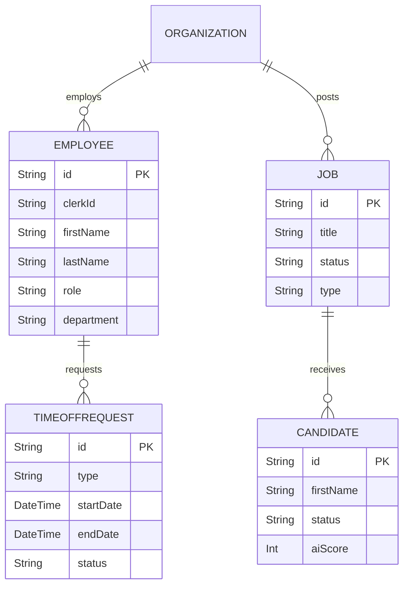

# Super HR - Developer Documentation

Welcome to the Super HR project! This document serves as the single source of truth for new developers joining the project. It outlines the full requirements, system architecture, data flows, and the development roadmap.

> [!NOTE]
> **Project Vision**: Super HR is a next-generation AI-powered HR management suite designed to transform workforce operations with intelligent automation, predictive analytics, and seamless user experience.

---

## 1. System Architecture & Flow

The application follows a modern full-stack architecture using Next.js 16 (App Router).

### High-Level Architecture
- **Frontend**: React 19 + TypeScript, styled with Tailwind CSS v4 and Radix UI components. Framer Motion is used for animations.
- **Backend**: Next.js API Routes (Server Components).
- **Database**: PostgreSQL (hosted on Supabase) accessed via **Prisma ORM**.
- **AI Layer**: Integrations planned for Google Gemini API for intelligent processing (resume parsing, career pathing).

### Core Data Flow
1. **Client Interaction**: User interacts with the Next.js frontend (Server & Client components).
2. **Data Fetching**: Server Components query the database directly using Prisma ORM.
3. **AI Processing**: Specific workflows (e.g., Resume Upload) trigger AI services to extract data, score candidates, or suggest career paths.
4. **State & UI**: React Context API and Local Storage manage client state, while Framer Motion handles transition animations.

---

## 2. Full Requirements & Modules

The platform is divided into several key modules, each addressing a specific HR need.

### Dashboard (Operational Hub)
- Role-based views for Admins and Employees.
- **AI Intelligence Brief**: Morning insights on capacity, retention, and compliance.
- **Smart Calendar & Tasks**: AI-optimized scheduling and intelligent task prioritization.

### Employee Management
- Comprehensive employee directory with avatars and roles.
- **AI Career Pathing & Retention Risk**: Predictive models for churn and trajectory.
- Built-in security audits and compliance tracking.

### Recruitment Module
- **Job Postings & Candidate Pipeline**: ATS capabilities with Kanban views.
- **AI Resume Scoring**: Automated candidate evaluation on a 0-100 scale.
- **Sub-modules**: Interview workspace, AI Outreach Engine, Assessment Center (with Synergy match scoring), and a Candidate Portal.

### Payroll & Finances
- Monthly payroll processing with payslip generation.
- Automated tax calculations and CSV exports.

### Time-Off Management
- Request workflows (Vacation, Sick Leave) with **AI Impact Analysis** for capacity modeling.
- Auto-approval system for pre-vetted requests based on a 92% optimal capacity threshold.

### Performance & Offboarding
- **Performance**: 360° feedback, OKR tracking, and AI proficiency analysis.
- **Offboarding**: Interactive departure checklist, financial settlement intelligence, and dynamic fallback systems for robust execution.

## 2.5 Role-Based Access Control (RBAC)

The application implements a robust 3-tier Role-Based Access Control system: **Admin**, **Manager**, and **Employee**. Permissions dictate UI rendering and data access across the platform.

### Access Matrix

| Module | Admin | Manager | Employee |
| :--- | :--- | :--- | :--- |
| **Dashboard** | Full access (Company Metrics, Global Tasks) | Team Overview, Approvals queue | Personal Tasks, Self-service overview |
| **Employees** | Full directory access, full edit rights | View direct reports/department only, edit non-financial data | View basic profiles of peers |
| **Recruitment** | Full access (Create jobs, view all candidates, salaries) | View candidates for their roles (salaries hidden) | **NO ACCESS** |
| **Time Off** | Approve/Reject company-wide | Approve/Reject for direct reports | Request time off, View balance |
| **Payroll** | Process payroll, view all data | **Self-Service Only** (View own payslips) | **Self-Service Only** (View own payslips) |
| **Assets** | Full access (Assign/Track all assets) | **Self-Service Only** (View assigned assets) | **Self-Service Only** (View assigned assets) |
| **Onboarding / Offboarding** | Manage company-wide | Manage direct reports | View own checklists |
| **Org Chart** | View entire structure | View entire structure | View entire structure |

> [!IMPORTANT]
> The current frontend implementation uses `userRole` from `useAuth` to enforce these rules dynamically. When implementing the backend, these checks **must** also be enforced at the API layer (Server Actions/API Routes) to ensure data security.

---

## 3. Data Model

The application uses Prisma to manage a relational PostgreSQL database. Here are the core entities:



---

## 4. Developer Setup & Workflow

### Prerequisites
- Node.js (v18+, recommended v20+)
- PostgreSQL Database

### Installation
1. Clone the repository and install dependencies: `npm install`
2. Configure `.env.local` with `DATABASE_URL`, authentication keys (Clerk), and `GEMINI_API_KEY`.
3. Initialize the database:
   ```bash
   npx prisma generate
   npx prisma db push
   ```
4. Start the development server: `npm run dev` (Runs on `http://localhost:3000`)
5. View the database via Prisma Studio: `npx prisma studio` (Runs on `http://localhost:5555`)

> [!WARNING]
> **Known Limitations**: The current implementation uses mock authentication (localStorage) and simulated AI responses. Integrating Clerk/Supabase Auth and the real Gemini API are high-priority pending tasks.

---

## 5. Development Plan & Roadmap

As a developer, your focus will be on transitioning the application from a mock/prototype state to a production-ready system.

### High Priority (Immediate Next Steps)
- **Authentication**: Replace mock auth with Clerk or Supabase Auth.
- **Database Hookup**: Replace hardcoded/mock UI data with live Prisma queries across all dashboards.
- **AI Integration**: Implement the actual Google Gemini API for the currently simulated features (resume scoring, intelligence briefs).
- **Storage**: Implement real file uploads for resumes (e.g., Supabase Storage).

### Medium Priority
- Build robust Next.js API Routes for external client access.
- Implement comprehensive unit and E2E testing (Jest + Playwright).
- Configure an email service (SendGrid/Resend) for system notifications.

### Best Practices for Contributing
- **Branching**: Use `feature/new-feature` branches and submit Pull Requests.
- **Components**: Prefer Server Components where possible. Use `"use client"` only when necessary for hooks or interactivity.
- **Styling**: Stick to the established Tailwind CSS v4 design tokens to maintain the premium glassmorphic UI.
